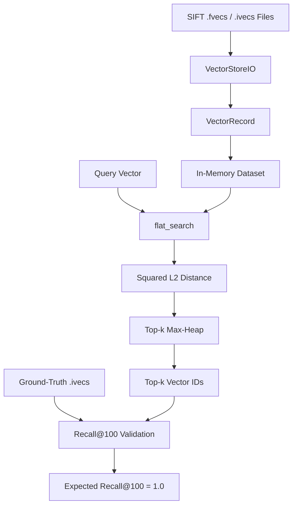

# VECTOR DB (PHASE 0)

## 1. Introduction / Overview

<table>
<tr>
<td valign="top" width="55%">

Phase 0 establishes the basic foundation of the vector database by implementing the core data representation, dataset loading, and exact vector search functionality.

The implementation will represent individual vectors as `VectorRecord<T>` objects containing a vector ID, vector data, and associated metadata. It will provide functionality to load vector datasets from the SIFT `.fvecs` and `.ivecs` binary formats into memory. On top of the loaded dataset, an exact brute-force k-nearest-neighbor (kNN) search will be implemented using squared L2 distance and a priority queue to maintain the top-k nearest vectors.

The results of the search will be compared against the provided ground-truth nearest-neighbor indices. Since Phase 0 uses an exact brute-force search, this validation establishes a correctness baseline for future, more optimized vector-search approaches.

**GOALS:**

1. Define a generic vector record representation.
2. Load SIFT `.fvecs`/`.ivecs` datasets into memory.
3. Implement exact brute-force kNN search.
4. Validate the implementation against provided ground truth.
5. Establish Recall@100 = 1.0 as the correctness baseline.

</td>
<td valign="top" width="45%">



</td>
</tr>
</table>

## 2. Data Model

### 2.1 Overview

The data model defines how vector data and information associated with each vector are represented in memory. Phase 0 introduces two primary structures: `Metadata` and `VectorRecord<T>`. A `VectorRecord<T>` represents a single vector entry and contains its identifier, vector data, and associated metadata.

### 2.2 Metadata

`Metadata` is represented using `std::unordered_map<std::string, std::any>`. It provides a flexible key-value structure for storing additional information associated with a vector record. The string keys identify individual metadata fields, while `std::any` allows values of different types to be stored. This prevents the vector record from being tied to a fixed set of metadata fields.

Metadata is included as an extensibility mechanism but is not populated or used during Phase 0 dataset loading or search.

### 2.3 VectorRecord\<T\>

`VectorRecord<T>` represents a single vector entry in the vector database. It contains an integer identifier, a `std::vector<T>` storing the vector's numerical values, and a `Metadata` object containing additional information associated with the vector.

Each loaded vector is assigned a sequential internal ID starting from 0, corresponding to its position in the dataset.

The structure is templated so that the vector element type can be specified when the record is instantiated. For example, `VectorRecord<float>` represents a record containing floating-point vector data, while `VectorRecord<int32_t>` can represent a record containing 32-bit integer data. This generic design allows the same record abstraction to be reused for different data types required by Phase 0.

The structure also provides a `dimension()` method returning the number of elements in the stored vector.

### 2.4 Structure

```cpp
template <typename T>
struct VectorRecord {
    int id;
    std::vector<T> vector;
    Metadata metadata;

    std::size_t dimension() const {
        return vector.size();
    }
};
```

## 3. Dataset / File Loading

### 3.1 Overview

Phase 0 requires loading vector datasets from the SIFT `.fvecs` and `.ivecs` binary file formats into the in-memory data structures defined in the data model. The `VectorStoreIO` component is responsible for handling file input and converting the binary representation into vector records.

### 3.2 File Format

Each vector in the `.fvecs` and `.ivecs` formats begins with a 4-byte dimension value, followed by the corresponding number of vector elements. `.fvecs` files contain floating-point vector values, while `.ivecs` files contain integer values used for index/ground-truth data.

### 3.3 Loading Process

The loader will open the input file in binary mode and process vectors sequentially. For each vector, it will first read the dimension, allocate storage for the required number of elements, and then read the vector values from the file. The resulting data will be represented using the templated `VectorRecord<T>` structure.

Reaching EOF after successfully reading complete records terminates loading normally. A truncated record results in an error (**exception** thrown).

### 3.4 Error Handling and Resource Management

If the input file cannot be opened, the loader will throw `std::runtime_error`. File resources will be managed using C++ RAII through the file stream, ensuring that resources are released automatically when the stream goes out of scope.

```cpp
class VectorStoreIO {
public:
    template <typename T>
    static std::vector<VectorRecord<T>>
    read_vecs(const std::string& file_path);
};
```

## 4. Search Design

### 4.1 Overview

Phase 0 implements an exact brute-force k-nearest-neighbor search through a `flat_search` operation. Given a query vector, the search evaluates its distance to every vector in the base dataset and maintains the k closest candidates. This provides a correctness baseline against which future optimized or approximate search methods can be evaluated.

### 4.2 Inputs and Outputs

The `flat_search` operation takes a query vector, the base vector dataset, and the desired number of nearest neighbours k. It returns the IDs of the k closest vector records.

* **Input:** Query vector, Base dataset, k
* **Output:** IDs of k nearest vectors

If k is not within required range, then throw `std::invalid_argument`

### 4.3 Search Procedure

The algorithm iterates through every vector in the base dataset and computes the squared L2 distance between the query and the current vector. A max-heap implemented using `std::priority_queue<std::pair<float, int>>` maintains the current top-k candidates.

If fewer than k candidates have been found, the current vector is inserted into the heap. Once the heap contains k candidates, a new vector is inserted only when its distance is smaller than the largest distance currently stored. The largest-distance candidate is then removed to maintain exactly k best candidates.

Distance is the primary ordering criterion; vector ID provides the tie-breaking order through `std::pair` comparison.

```cpp
std::vector<int>
flat_search(
    const std::vector<float>& query,
    const std::vector<VectorRecord<float>>& base,
    std::size_t k
);
```

### 4.4 Algorithm

```
Create empty max-heap

For each vector in the base dataset:
    Compute squared L2 distance

    If heap size < k:
        Insert (distance, id)

    Else if distance < heap.top().distance:
        Remove heap.top()
        Insert (distance, id)

Return the IDs of the k remaining candidates
```

The returned IDs are ordered from smallest squared L2 distance to largest.

## 5. Distance Metric

### 5.1 Squared L2 Distance

Phase 0 uses squared L2 distance to measure the distance between a query vector and each vector in the base dataset. For two vectors $Q$ and $V$ of dimension $D$, the squared L2 distance is defined as:

$$d^2(Q, V) = \sum_{i=1}^{D} (Q_i - V_i)^2$$

The square root used in standard Euclidean distance is intentionally omitted. Since the square-root function is monotonically increasing, omitting it does not change the ordering of vectors by distance. Therefore, the same nearest neighbours are obtained while avoiding the additional square-root computation.

### 5.2 Dimensionality

The query vector and database vectors must have the same dimensionality in order for the distance to be computed correctly. The SIFT-small dataset used for Phase 0 contains vectors of dimension 128.

### 5.3 Complexity

For a query vector of dimension D, computing the squared L2 distance to a single vector requires examining all D dimensions. Therefore, each distance calculation takes **O(D)** time.

During `flat_search`, the query is compared with all N vectors in the base dataset. Maintaining the top-k candidates using a max-heap requires $O(\log k)$ time for each insertion or removal.

Thus, the overall time complexity of `flat_search` is:

$$O(ND + N\log k)$$

The additional space used by the search operation is **O(k)** for the priority queue, excluding the memory occupied by the dataset itself.

## 6. Validation and Correctness

### 6.1 Validation Strategy

The correctness of the Phase 0 implementation will be validated using the SIFT-small dataset and its provided ground-truth nearest-neighbor indices. For each query, `flat_search` will be executed with k = 100, and the returned vector IDs will be compared against the corresponding ground-truth IDs.

### 6.2 Recall@100

Recall@100 will be used as the primary correctness metric. It measures the proportion of the true top-100 nearest neighbours that are retrieved by the search implementation.

$$Recall@100 = \frac{\text{number of ground-truth neighbours retrieved}}{100}$$

### 6.3 Expected Result

Since Phase 0 uses an exact brute-force search that evaluates every base vector using squared L2 distance, the implementation is expected to reproduce the ground-truth nearest neighbours. The target validation result is Recall@100 = 1.0.

### 6.4 Validation Dataset

| Parameter | Value |
|---|---|
| Base vectors | 10,000 |
| Vector dimension | 128 |
| Query vectors | 100 |
| k | 100 |
| Expected Recall@100 | 1.0 |
